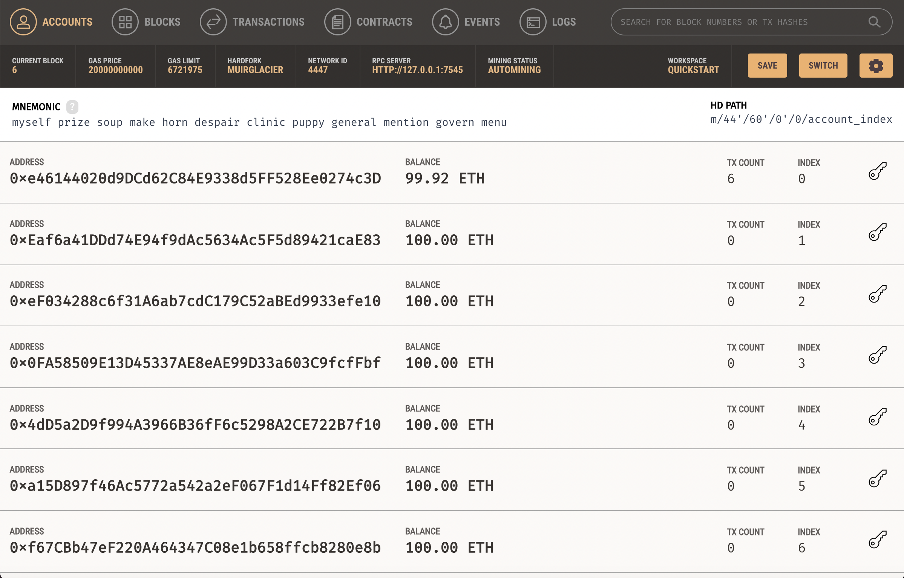
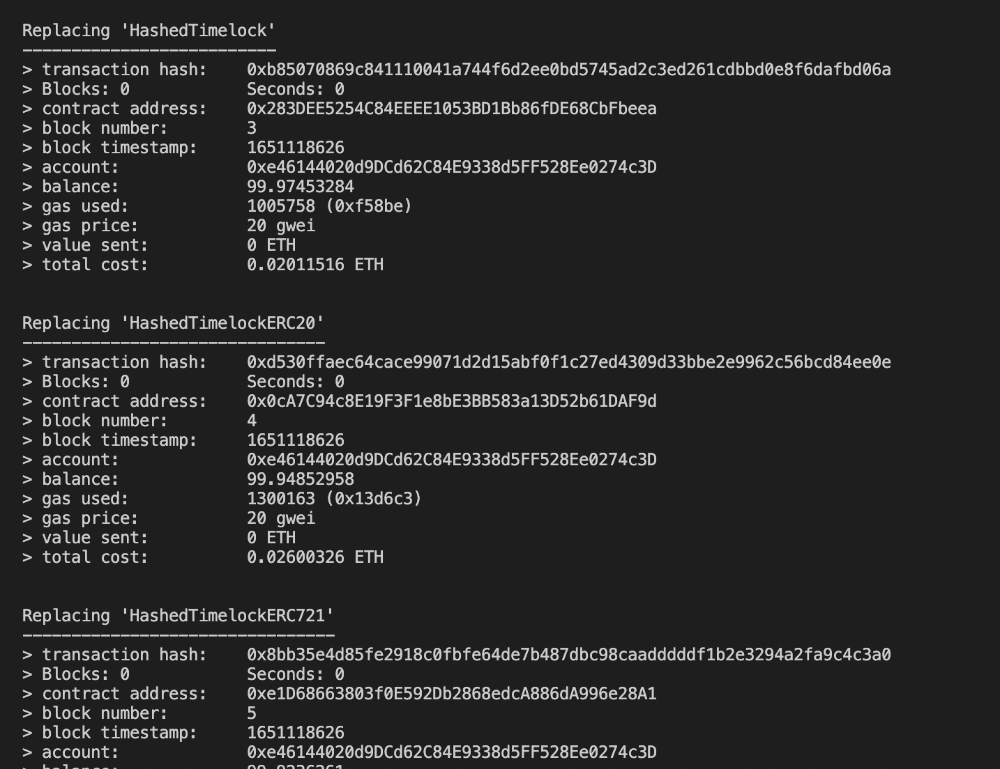

## Run Tests
* Install dependencies
* Start [Ganache](https://www.trufflesuite.com/ganache) with network ID `4447`
* Run the [Truffle](https://www.trufflesuite.com/truffle) tests

```
$ npm install
$ npm run ganache-start
$ npm run test
```
## HTLC operaion

1. start Ganache with network ID `4447` and then you can see



2. run `truffle migrate` and the you can see the transaction process.

